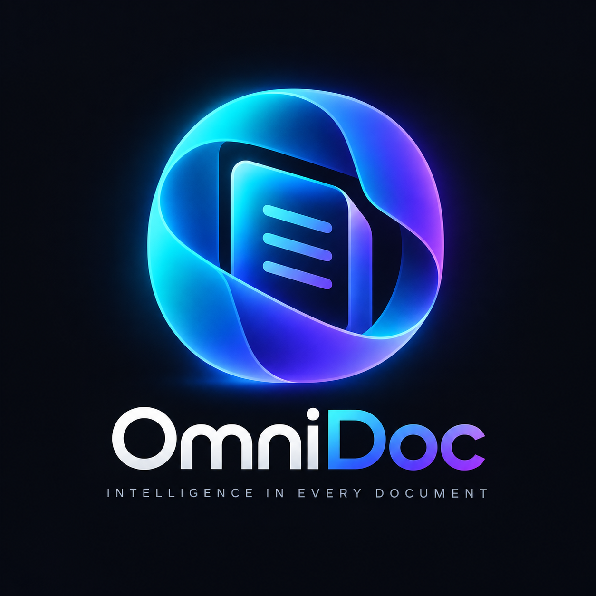

<p align="center">
  
</p>

<p align="center">
  <strong>Enterprise Document Intelligence & Semantic RAG Platform</strong><br>
  <em>Nền tảng RAG cho doanh nghiệp: upload tài liệu, đánh chỉ mục ngữ nghĩa và chat hỏi-đáp real-time.</em>
</p>

<p align="center">
  
  
  
  
  
  
  
  
</p>

---

## 📑 Mục lục

- [Tổng quan dự án](#-tổng-quan-dự-án)
- [Tính năng cốt lõi (Core Features)](#-tính-năng-cốt-lõi-core-features)
- [Tech Stack Ma trận](#-tech-stack-ma-trận)
- [Kiến trúc hệ thống & Luồng dữ liệu](#-kiến-trúc-hệ-thống--luồng-dữ-liệu)
  - [1. Ingestion Pipeline (Nạp & Lập chỉ mục tài liệu)](#1-ingestion-pipeline-nạp--lập-chỉ-mục-tài-liệu)
  - [2. RAG Query & Streaming Pipeline (Truy vấn & Trả lời ngữ nghĩa)](#2-rag-query--streaming-pipeline-truy-vấn--trả-lời-ngữ-nghĩa)
  - [3. Cấu trúc thư mục Clean Architecture & App Router](#3-cấu-trúc-thư-mục-clean-architecture--app-router)
- [Bảng ma trận biến môi trường (Environment Variables)](#-bảng-ma-trận-biến-môi-trường-environment-variables)
- [Quickstart Guide](#-quickstart-guide)
  - [Yêu cầu tiên quyết (Prerequisites)](#yêu-cầu-tiên-quyết-prerequisites)
  - [Bước 1: Clone mã nguồn](#bước-1-clone-mã-nguồn)
  - [Bước 2: Chuẩn bị biến môi trường (.env)](#bước-2-chuẩn-bị-biến-môi-trường-env)
  - [Cách 1: Khởi chạy trọn gói bằng Docker Compose (Khuyên dùng)](#cách-1-khởi-chạy-trọn-gói-bằng-docker-compose-khuyên-dùng)
  - [Cách 2: Chế độ Hybrid Development (Chỉnh sửa mã nguồn trực tiếp)](#cách-2-chế-độ-hybrid-development-chỉnh-sửa-mã-nguồn-trực-tiếp)
  - [Danh sách URL truy cập dịch vụ cục bộ](#-danh-sách-url-truy-cập-dịch-vụ-cục-bộ)
- [Trải nghiệm hệ thống lần đầu (First-time Walkthrough)](#-trải-nghiệm-hệ-thống-lần-đầu-first-time-walkthrough)
- [Chế độ Showcase & Dữ liệu mẫu (Demo Mode)](#-chế-độ-showcase--dữ-liệu-mẫu-demo-mode)
- [Xử lý sự cố thường gặp ở Local (Troubleshooting)](#-xử-lý-sự-cố-thường-gặp-ở-local-troubleshooting)

---

## 🌟 Tổng quan dự án

**OmniDoc** là một nền tảng RAG (Retrieval-Augmented Generation) tự host, giải quyết bài toán tải lên tài liệu đa định dạng, bóc tách nội dung, đánh chỉ mục ngữ nghĩa và chat hỏi-đáp trực tiếp với AI theo thời gian thực dựa trên ngữ cảnh tài liệu đó.

Người dùng tạo Workspace, upload tài liệu (PDF, Word, Excel, Slide...), hệ thống tự bóc tách text, chia nhỏ thành các chunk, tính vector ngữ nghĩa và lưu vào database. Khi người dùng hỏi, hệ thống tìm các đoạn trích liên quan nhất, đưa vào ngữ cảnh cho LLM rồi stream câu trả lời kèm trích dẫn nguồn (số trang, đoạn văn) về giao diện theo thời gian thực.

Hai điểm đáng chú ý: hệ thống tự động chuẩn hóa mọi định dạng tài liệu về Canonical PDF trước khi trích xuất (để trích dẫn luôn khớp đúng số trang gốc), và tầng AI được trừu tượng hóa qua interface nên có thể đổi qua lại giữa Google Gemini, OpenAI, Anthropic Claude, DeepSeek hoặc LLM chạy local qua Ollama mà không phải sửa code nghiệp vụ.

---

## 🚀 Tính năng cốt lõi (Core Features)

### 1. Document Ingestion Pipeline tự động & đa định dạng
- **Định dạng hỗ trợ:** PDF (`.pdf`), Word (`.docx`), PowerPoint (`.pptx`), Excel (`.xlsx`), CSV (`.csv`), Markdown (`.md`), Plain Text (`.txt`).
- **Chuẩn hóa qua Gotenberg:** Gotenberg v8 (engine LibreOffice và Chromium headless) chuyển mọi tài liệu văn phòng về PDF chuẩn hóa trước khi trích xuất, để PDF Viewer hiển thị đồng nhất bất kể định dạng gốc.
- **Trích xuất phân trang:** `PdfPig` bóc tách text kèm tọa độ trang thực tế, không phụ thuộc Adobe SDK.
- **Recursive Text Chunking:** Phân đoạn văn bản đệ quy, giữ ngữ cảnh câu/đoạn, có overlap giữa các chunk và lưu đúng `PageNumber` cho từng chunk.
- **Theo dõi tiến trình real-time:** SignalR Hub (`DocumentProgressHub`) bắn trạng thái xử lý về UI qua các bước:
  - `Validating` (5%) → `Normalizing` (30%) → `Extracting` (40-45%) → `Chunking` (50%) → `Embedding` (50-90%) → `Completed` (100%).
  - Nếu lỗi, hệ thống ghi `FailureCode` kèm thông báo cụ thể để dễ debug hơn là chỉ báo "thất bại".

### 2. Semantic Vector Search với PostgreSQL + pgvector
- **Vector embedding 768 chiều**, mặc định tham chiếu theo `gemini-embedding-2`.
- **Cosine Distance Search:** Dùng toán tử `<=>` của `pgvector` ngay trong PostgreSQL, lọc theo `1 - Distance >= MinSimilarityScore` để lấy các chunk gần nghĩa nhất — không cần vector DB riêng.
- **Cô lập theo Workspace:** Mọi chunk gắn với `WorkspaceId`, nên dữ liệu giữa các tenant không lẫn vào nhau.

### 3. Chat AI real-time kèm trích dẫn nguồn
- **Streaming qua SSE:** API stream token trực tiếp về UI, tắt buffer (`X-Accel-Buffering: no`) để chữ hiện ra ngay khi model sinh ra, không bị giật cục.
- **Citation State Machine:** `CitationStreamStateMachine` quét luồng token, phát hiện điểm trích dẫn và gắn thành các badge có thể bấm vào — xem tên tài liệu, số trang và đoạn trích (`Excerpt`) gốc.
- **Lịch sử hội thoại đa lượt:** Lưu theo phiên, tự ghép ngữ cảnh các lượt trước vào prompt RAG để model không "quên" câu hỏi trước đó.

### 4. Kiến trúc AI pluggable, không khóa vào một nhà cung cấp
- Tầng AI được trừu tượng qua interface `IChatCompletionService` và `IEmbeddingService`.
- Tương thích sẵn với Microsoft Semantic Kernel và Microsoft.Extensions.AI.
- Đổi provider chỉ qua biến môi trường, không cần sửa code:
  - **Google Gemini API:** `gemini-3.6-flash` cho chat, `gemini-embedding-2` cho embedding (mặc định).
  - **Local LLM / OpenAI-compatible:** Ollama, vLLM, DeepSeek, Claude, GPT-4o.
  - **Mock mode (`AI_PROVIDER=Mock`):** Dịch vụ giả lập offline — chạy thử toàn bộ hệ thống mà không tốn API key hay chi phí gọi model.

### 5. Multi-tenant Workspaces & bảo mật
- **RBAC:** `Owner`, `Admin`, `Member`.
- **Mời thành viên qua email:** Token mời (`WorkspaceInvitation`) có thời hạn.
- **JWT stateful qua TokenVersion:** Mỗi user có một trường `TokenVersion`. Đăng xuất hoặc đổi mật khẩu sẽ tăng giá trị này lên, khiến mọi token cũ (trên mọi thiết bị) hết hiệu lực ngay lập tức — không cần đợi JWT tự hết hạn.
- **Bảo mật tài khoản:** Đăng ký yêu cầu OTP xác thực email, quên mật khẩu qua link có chữ ký (kiểm tra bằng Mailpit ở local).

---

## 🛠 Tech Stack Ma trận

| Phân tầng (Layer) | Công nghệ / Thư viện chính | Phiên bản | Vai trò & Mục đích sử dụng |
| :--- | :--- | :--- | :--- |
| **Backend Framework** | .NET (C#) | `10.0` (`net10.0`) | Nền tảng thực thi Web API, lập trình bất đồng bộ |
| **Kiến trúc ứng dụng** | Clean Architecture + CQRS | MediatR `14.2.0` | Tách ranh giới giữa Domain, Application, Infrastructure và Presentation |
| **ORM & Data Access** | EF Core + Npgsql | `10.0.11` / `10.0.3` | Quản trị database quan hệ, chạy migrations tự động |
| **Vector Database** | PostgreSQL + pgvector | PG `17` / pgvector `0.3.0` | Lưu dữ liệu hệ thống và bảng chỉ mục vector embedding 768 chiều |
| **Background Processing** | Hangfire | `1.8.25` | Quản lý tác vụ chạy ngầm phân tán (Document Ingestion, Email Outbox) |
| **Document Processing** | Gotenberg | `8.0` (Docker) | Chuyển DOCX, PPTX, XLSX, CSV, HTML sang Canonical PDF qua API |
| **PDF Text Parsing** | PdfPig | `0.1.16` | Bóc tách text và tọa độ trang từ PDF, không phụ thuộc Adobe SDK |
| **AI / Semantic Engine** | Semantic Kernel / Custom Clients | `1.80.0` | Trừu tượng hóa tầng AI; tích hợp mặc định Google Gemini API |
| **Caching & Lock** | Redis | `7-alpine` | Cache dữ liệu, rate limiting và distributed lock |
| **Realtime Gateway** | SignalR + SSE | ASP.NET Core SignalR | Bắn tiến trình xử lý tài liệu và stream tin nhắn chat |
| **API Docs & Testing** | Scalar + OpenAPI | Scalar `2.17.1` | Tài liệu API tương tác chuẩn OpenAPI tại `/scalar/v1` |
| **Email Mocking** | Mailpit | `latest` (Docker) | SMTP giả lập kèm Web UI xem email OTP tại cổng `8025` |
| **Frontend Framework** | Next.js (App Router) | `16.3.3` | React SSR/SSG, Server Actions |
| **UI Library & Styling** | React + Tailwind CSS | React `19.2.8` / Tailwind `v4` | Giao diện responsive, dark mode |
| **Reverse Proxy / Edge** | Nginx | `1.28-alpine` | Định tuyến `/api/`, `/hubs/`, `/` và xử lý SSE |

---

## 🏗 Kiến trúc hệ thống & Luồng dữ liệu

### 1. Ingestion Pipeline (Nạp & Lập chỉ mục tài liệu)

```
[Người dùng tải tệp lên]
        │ (PDF, Word, Excel, PowerPoint, Text, CSV)
        ▼
[OmniDoc Web API (Upload Controller)]
        │ 1. Lưu tệp gốc vào File Storage (/app/data/documents)
        │ 2. Khởi tạo Document record (Status: Uploaded)
        ▼
[Hangfire Background Queue: DocumentProcessingJob]
        │
        ├─► [Giai đoạn Validating - 5%]
        │   Kiểm tra định dạng, dung lượng và tính toàn vẹn của tệp
        │
        ├─► [Giai đoạn Normalizing - 30%]
        │   Gửi tệp sang Gotenberg (Chromium/LibreOffice Engine)
        │   ──► Sinh ra tệp chuẩn hóa: Canonical PDF
        │
        ├─► [Giai đoạn Extracting - 40~45%]
        │   PdfPig bóc tách toàn bộ nội dung văn bản kèm số trang (PageNumber)
        │
        ├─► [Giai đoạn Chunking - 50%]
        │   RecursiveTextChunker phân đoạn đệ quy theo kích thước và độ gối đầu (Overlap)
        │
        ├─► [Giai đoạn Embedding - 50~90%]
        │   Gửi từng lô (Batch 16 chunks) sang IEmbeddingService (Gemini / Mock)
        │   ──► Nhận về mảng Vector số thực 768 chiều
        │
        └─► [Giai đoạn Completed - 100%]
            Lưu các DocumentChunks vào PostgreSQL (pgvector)
            Cập nhật Document.Status = Indexed
            Bắn sự kiện hoàn tất tới client qua SignalR DocumentProgressHub
```

### 2. RAG Query & Streaming Pipeline (Truy vấn & Trả lời ngữ nghĩa)

```
[Client (Next.js Frontend)]
        │
        │ POST /api/workspaces/{id}/chat/stream (Câu hỏi người dùng)
        ▼
[ChatController (StreamMessageQuery)]
        │
        ├─► 1. Gọi IEmbeddingService sinh vector embedding cho câu hỏi
        │
        ├─► 2. Truy vấn Vector Database (PostgreSQL + pgvector):
        │      Thực thi Cosine Distance: chunk.Embedding <=> QueryVector
        │      Lọc theo: WorkspaceId == currentWorkspaceId
        │      Lấy ra Top-K chunks phù hợp nhất có điểm tương đồng cao
        │
        ├─► 3. RagPromptBuilder:
        │      Ghép nội dung trích xuất (Context Chunks) + Lịch sử hội thoại + Câu hỏi
        │
        ├─► 4. Gọi IChatCompletionService (Gemini / Mock / Local LLM)
        │      Khởi tạo luồng sinh phản hồi (StreamResponseAsync)
        │
        ├─► 5. CitationStreamStateMachine:
        │      Quét token, phát hiện tham chiếu nguồn tài liệu
        │      Chuyển đổi thành các Citation frame (DocumentTitle, PageNumber, Excerpt)
        │
        ▼
[Nginx Edge Proxy] (X-Accel-Buffering: no, Connection: keep-alive)
        │
        ▼
[Client SSE Consumer (useChatStream hook)]
        Render từng từ theo thời gian thực + Hiển thị thẻ trích dẫn tài liệu dẫn chứng
```

### 3. Cấu trúc thư mục Clean Architecture & App Router

```
OmniDoc/
├── backend/                              # Kiến trúc Clean Architecture .NET 10
│   ├── src/
│   │   ├── Core/
│   │   │   ├── OmniDoc.Domain/          # Thực thể lõi (Entities, Enums, Exceptions)
│   │   │   │   ├── Entities/            # Document, DocumentChunk, Workspace, User, v.v.
│   │   │   │   └── Enums/               # DocumentFormat, ProcessingStage, WorkspaceRole
│   │   │   └── OmniDoc.Application/     # Use Cases, CQRS (MediatR), Interfaces, DTOs
│   │   │       ├── Common/              # Interfaces (IEmbeddingService, IChatCompletionService)
│   │   │       └── Features/            # Auth, Chat, Documents, Invitations, Workspaces
│   │   ├── Infrastructure/
│   │   │   ├── OmniDoc.Persistence/     # Entity Framework Core, Migrations, pgvector configs
│   │   │   │   ├── Configurations/      # Fluent API mappings (DocumentChunkConfiguration, v.v.)
│   │   │   │   ├── Contexts/            # ApplicationDbContext
│   │   │   │   └── Migrations/          # Các file EF Core Migration đã tạo
│   │   │   └── OmniDoc.Infrastructure/  # Thực thi dịch vụ ngoại vi
│   │   │       ├── Jobs/                # DocumentProcessingJob, EmailOutboxDispatcher
│   │   │       ├── Services/            # Gotenberg, PdfPig, RecursiveChunker, VectorRetrieval
│   │   │       └── Services/Ai/         # GeminiChatCompletionService, GeminiEmbeddingService
│   │   └── Presentation/
│   │       └── OmniDoc.API/             # REST API Controllers, SignalR Hubs, Middleware
│   │           ├── Controllers/         # AuthController, ChatController, DocumentsController
│   │           ├── Hubs/                # DocumentProgressHub, NotificationHub
│   │           └── Program.cs           # Cấu hình DI, Middleware, Scalar API Docs, Hangfire
│   └── tests/
│       └── OmniDoc.UnitTests/           # Kiểm thử đơn vị cho toàn bộ các layer
│
├── frontend/                             # Giao diện Next.js 16 (App Router) + React 19
│   ├── public/images/                   # Logo, biểu tượng hệ thống (logo-full.png)
│   └── src/
│       ├── app/                         # App Router Pages & Layouts
│       │   ├── (auth)/                  # Đăng nhập, đăng ký, quên/đặt lại mật khẩu
│       │   ├── (dashboard)/             # Quản lý không gian làm việc, tài liệu, cài đặt
│       │   │   └── workspaces/[id]/chat # Giao diện Chat RAG tương tác thời gian thực
│       │   ├── layout.tsx               # Root layout với ThemeProvider & AuthProvider
│       │   └── page.tsx                 # Trang Landing Page giới thiệu giải pháp
│       ├── components/                  # UI Components tách biệt theo module
│       │   ├── auth/                    # Modal OTP, Form đăng nhập/đăng ký
│       │   ├── chat/                    # Khung chat, Citation badges, Markdown renderer
│       │   ├── document/                # Dropzone tải tài liệu, PDF Viewer, Progress badges
│       │   └── workspace/               # Chuyển đổi workspace, quản lý thành viên
│       ├── hooks/                       # Custom hooks (useChatStream, useSignalR, useAuth)
│       └── services/                    # Tầng giao tiếp HTTP API Client
│
├── nginx/                               # Cấu hình Nginx Reverse Proxy (default.conf)
├── tools/                               # Bộ công cụ kiểm thử tự động, dữ liệu mẫu
├── docker-compose.yml                   # Khởi chạy toàn bộ hạ tầng chỉ với một lệnh
├── .env.example                         # File mẫu cấu hình biến môi trường
└── README.md                            # Tài liệu hướng dẫn hệ thống
```

---

## 🔐 Bảng ma trận biến môi trường (Environment Variables)

Cấu hình nằm trong file `.env` ở thư mục gốc.

| Tên biến môi trường | Giá trị mặc định | Bắt buộc / Tùy chọn | Giải thích kỹ thuật & Hướng dẫn thiết lập |
| :--- | :--- | :--- | :--- |
| **`COMPOSE_PROJECT_NAME`** | `omnidoc` | Tùy chọn | Tên nhóm container trong Docker Compose. |
| **`APP_URL`** | `http://localhost` | Khuyên dùng | Địa chỉ gốc truy cập ứng dụng từ trình duyệt. |
| **`POSTGRES_DB`** | `omnidoc_db` | Bắt buộc | Tên database PostgreSQL. |
| **`POSTGRES_USER`** | `omnidoc` | Bắt buộc | Tài khoản quản trị database. |
| **`POSTGRES_PASSWORD`** | *(Trống)* | **Bắt buộc** | Mật khẩu database (ví dụ: `OmniDocDevSecret2026!`). |
| **`JWT_SECRET`** | *(Trống)* | **Bắt buộc** | Khóa bí mật mã hóa JWT (tối thiểu 32 ký tự ngẫu nhiên). |
| **`JWT_ISSUER`** | `OmniDocApi` | Tùy chọn | Tên đơn vị phát hành token JWT. |
| **`JWT_AUDIENCE`** | `OmniDocClient` | Tùy chọn | Tên đối tượng nhận token JWT. |
| **`JWT_EXPIRY_MINUTES`**| `1440` | Tùy chọn | Thời gian sống JWT (1440 phút = 24 giờ). |
| **`AI_PROVIDER`** | `Gemini` | **Bắt buộc** | Chọn provider AI: `Gemini` hoặc `Mock` (offline). |
| **`GEMINI_API_KEY`** | *(Trống)* | Bắt buộc nếu dùng Gemini | Lấy từ Google AI Studio (bỏ trống nếu `AI_PROVIDER=Mock`). |
| **`GEMINI_CHAT_MODEL`** | `gemini-3.6-flash` | Tùy chọn | Model xử lý hội thoại RAG. |
| **`GEMINI_EMBEDDING_MODEL`**| `gemini-embedding-2` | Tùy chọn | Model sinh vector embedding 768 chiều. |
| **`GOTENBERG_BASE_URL`**| `http://gotenberg:3000`| Tùy chọn | Địa chỉ nội bộ tới dịch vụ Gotenberg. |
| **`SMTP_HOST`** | `mailpit` | Tùy chọn | Máy chủ gửi email (`mailpit` trong Docker, `localhost` nếu chạy ngoài). |
| **`SMTP_PORT`** | `1025` | Tùy chọn | Cổng SMTP của Mailpit. |
| **`EMAIL_SHOW_DEMO_OTP`**| `false` | Tùy chọn | Đặt `true` để API trả thẳng mã OTP trong response, tiện test nhanh. |
| **`SHOWCASE_ENABLED`** | `false` | Tùy chọn | Bật chế độ Demo Showcase. |
| **`SHOWCASE_SEED_ON_STARTUP`**| `false` | Tùy chọn | Tự nạp tài liệu mẫu và tài khoản demo khi API khởi động. |
| **`NEXT_PUBLIC_SHOWCASE_ENABLED`**| `false` | Tùy chọn | Cờ phía frontend để hiện nút đăng nhập demo nhanh. |

> [!TIP]
> **Lấy Google Gemini API Key miễn phí:**
> 1. Vào [Google AI Studio](https://aistudio.google.com/).
> 2. Đăng nhập bằng tài khoản Google, nhấn **Get API Key**.
> 3. Tạo key mới, dán vào `GEMINI_API_KEY` trong `.env`.
> 
> *Không muốn xin API key hoặc không có mạng? Đặt `AI_PROVIDER=Mock` là chạy được ngay.*

---

## 💻 (Quickstart Guide)

### Yêu cầu tiên quyết (Prerequisites)
- **Git** ([Tải Git](https://git-scm.com/)).
- **Docker & Docker Desktop:** cần Docker Engine hỗ trợ Compose v2 ([Tải Docker Desktop](https://www.docker.com/products/docker-desktop/)). Đảm bảo Docker Desktop đang chạy.
- *(Chỉ cần cho Cách 2 - Hybrid Dev):*
  - **.NET 10 SDK** ([Tải .NET 10](https://dotnet.microsoft.com/download/dotnet/10.0))
  - **Node.js 20+** và **npm** ([Tải Node.js](https://nodejs.org/))

---

### Bước 1: Clone mã nguồn

```bash
git clone https://github.com/Danter34/OmniDoc.git
cd OmniDoc
```

---

### Bước 2: Chuẩn bị biến môi trường (.env)

Tạo `.env` từ file mẫu `.env.example`:

**Trên Linux / macOS:**
```bash
cp .env.example .env
```

**Trên Windows (PowerShell):**
```powershell
Copy-Item .env.example .env
```

Mở `.env` và cập nhật tối thiểu:
```ini
# Đặt mật khẩu tùy ý cho database
POSTGRES_PASSWORD=OmniDocPassword2026!

# Sinh một chuỗi ngẫu nhiên tối thiểu 32 ký tự làm JWT Secret
JWT_SECRET=super-secret-key-with-at-least-32-characters-long!

# Cấu hình AI: Điền Gemini API Key hoặc chọn chế độ Mock
AI_PROVIDER=Gemini
GEMINI_API_KEY=AIzaSyYourActualGeminiApiKeyHere...
# (Nếu không có key, đổi thành: AI_PROVIDER=Mock)
```

---

### Cách 1: Khởi chạy trọn gói bằng Docker Compose (Khuyên dùng)

Đơn giản nhất — mọi dịch vụ (PostgreSQL pgvector, Redis, Gotenberg, Mailpit, backend .NET, frontend Next.js, Nginx) chạy trong container.

#### 1. Khởi động các dịch vụ hạ tầng:
```bash
docker compose up -d db redis gotenberg mailpit
```

#### 2. Khởi tạo schema database qua migration:
```bash
docker compose run --rm --no-deps backend --migrate-only=true
```
*Chạy một container backend tạm để EF Core thực thi migration lên PostgreSQL (bật pgvector extension và tạo bảng).*

#### 3. Khởi chạy toàn bộ hệ thống:
```bash
docker compose up -d --build
```
*Build image backend, image frontend, khởi chạy Nginx tại cổng 80.*

> [!NOTE]
> Theo dõi trạng thái khởi động:
> ```bash
> docker compose ps
> ```
> Khi các container ở trạng thái `healthy` hoặc `running`, hệ thống sẵn sàng.

---

### Cách 2: Chế độ Hybrid Development (Chỉnh sửa mã nguồn trực tiếp)

Dành cho ai muốn debug hoặc sửa code Backend / Frontend trực tiếp trên máy.

#### Bước 2.1: Chạy hạ tầng phụ trợ bằng Docker
```bash
docker compose up -d db redis gotenberg mailpit
```

#### Bước 2.2: Khởi chạy Backend (.NET 10 API)
1. Terminal thứ nhất:
   ```bash
   cd backend
   ```
2. Cập nhật database:
   ```bash
   dotnet ef database update --project src/Infrastructure/OmniDoc.Persistence --startup-project src/Presentation/OmniDoc.API
   ```
3. Chạy API:
   ```bash
   dotnet run --project src/Presentation/OmniDoc.API
   ```
   *Backend lắng nghe tại `http://localhost:5151` (và `https://localhost:7157`). Scalar API Docs tại `http://localhost:5151/scalar/v1`.*

#### Bước 2.3: Khởi chạy Frontend (Next.js)
1. Terminal thứ hai:
   ```bash
   cd frontend
   ```
2. Cài dependencies:
   ```bash
   npm install
   ```
3. Chạy dev server:
   ```bash
   npm run dev
   ```
   *Frontend chạy tại `http://localhost:3000`, tự kết nối backend tại `http://localhost:5151`.*

---

### 🌐 Danh sách URL truy cập dịch vụ cục bộ

| Dịch vụ | Docker Compose (Cách 1) | Hybrid Dev (Cách 2) | Mục đích & Tài khoản mẫu |
| :--- | :--- | :--- | :--- |
| **Web UI (Frontend)** | `http://localhost` (Port 80) | `http://localhost:3000` | Giao diện chính của OmniDoc |
| **API Health Check** | `http://localhost/api/health` | `http://localhost:5151/api/health` | Kiểm tra Backend API còn sống |
| **Interactive API Docs**| `http://localhost/scalar/v1` | `http://localhost:5151/scalar/v1` | Thử API qua giao diện Scalar |
| **Hangfire Dashboard** | *(Chỉ bật ở Dev)* | `http://localhost:5151/hangfire` | Quản lý Background Jobs |
| **Mailpit Web UI** | `http://localhost:8025` | `http://localhost:8025` | Hộp thư giả lập, đọc **mã OTP đăng ký** |
| **PostgreSQL Port** | `localhost:5432` | `localhost:5432` | Kết nối CSDL (`User: omnidoc`, `DB: omnidoc_db`) |

---

## 🎯 Trải nghiệm hệ thống lần đầu (First-time Walkthrough)

1. **Mở trình duyệt:** vào `http://localhost` (hoặc `http://localhost:3000` nếu chạy Hybrid).
2. **Đăng ký tài khoản:**
   - Nhấn **Bắt đầu ngay** hoặc **Đăng ký**.
   - Nhập Tên, Email, Mật khẩu (tối thiểu 8 ký tự, có chữ hoa, số và ký tự đặc biệt).
   - Hệ thống gửi mã OTP 6 số để xác thực.
3. **Lấy mã OTP:**
   - Mở tab mới, vào **Mailpit Web UI**: `http://localhost:8025`.
   - Mở email mới nhất từ OmniDoc, copy mã OTP.
   - Quay lại trang đăng ký, nhập mã để kích hoạt tài khoản.
4. **Tạo Workspace:**
   - Đặt tên (ví dụ: *Dự Án Nghiên Cứu AI*).
5. **Upload tài liệu:**
   - Kéo thả PDF, Word hoặc Markdown vào vùng tải tệp.
   - Theo dõi tiến trình real-time (Validating → Normalizing → Extracting → Chunking → Embedding → Hoàn tất).
6. **Chat với AI:**
   - Chuyển sang tab **Trò chuyện (Chat)**.
   - Hỏi các câu liên quan đến nội dung vừa upload.
   - Xem câu trả lời gõ chữ theo thời gian thực, bấm vào thẻ trích dẫn (Citations) để đối chiếu nguồn kèm số trang gốc.

---

## 🎪 Chế độ Showcase & Dữ liệu mẫu (Demo Mode)

OmniDoc đi kèm sẵn một bộ dữ liệu mẫu về tài chính khu vực (*Báo cáo Ổn định Tài chính ASEAN+3 2024 - AMRO*) cùng vector embedding đã tính sẵn, để bạn thử hệ thống mà không cần đăng ký hay tự upload tài liệu:

1. Trong `.env`, bật các cờ:
   ```ini
   SHOWCASE_ENABLED=true
   SHOWCASE_SEED_ON_STARTUP=true
   NEXT_PUBLIC_SHOWCASE_ENABLED=true
   ```
2. Khởi động lại:
   ```bash
   docker compose up -d --build
   ```
3. Trên trang đăng nhập sẽ có nút **Trải nghiệm nhanh với tài khoản Demo**:
   - **Email:** `guest@omnidoc.io`
   - **Mật khẩu:** `OmniDoc-Showcase2026!`
   - Đăng nhập xong là có sẵn một Workspace với tài liệu đã lập chỉ mục, chat được ngay.

---

## 🔧 Xử lý sự cố thường gặp ở Local (Troubleshooting)

### 1. Lỗi xung đột cổng (Port Conflict)
- **Triệu chứng:** Container không bind được vào cổng `5432`, `80` hoặc `8025`.
- **Nguyên nhân:** Máy bạn đã có PostgreSQL hoặc web server khác (IIS, Apache, Skype) chiếm cổng đó.
- **Cách khắc phục:**
  - Kiểm tra cổng đang bị chiếm (Windows PowerShell):
    ```powershell
    Get-NetTCPConnection -LocalPort 5432, 80, 8025 -ErrorAction SilentlyContinue
    ```
  - Tạm dừng dịch vụ PostgreSQL cục bộ (`services.msc`) hoặc đổi cổng ánh xạ trong `docker-compose.yml` (ví dụ `"80:80"` → `"8088:80"`).

### 2. Lỗi Quota / Rate-limit khi gọi Gemini API (HTTP 429)
- **Triệu chứng:** Tài liệu lỗi ở giai đoạn `Embedding`, hoặc chat báo lỗi từ AI provider.
- **Nguyên nhân:** Gemini API key free chạm giới hạn số lượt gọi/phút.
- **Cách khắc phục:**
  - Chuyển tạm sang Mock mode trong `.env`:
    ```ini
    AI_PROVIDER=Mock
    ```
  - Restart backend: `docker compose restart backend`. Hệ thống chạy tiếp với câu trả lời giả lập.

### 3. Không nhận được email OTP đăng ký
- **Nguyên nhân:** Chưa mở Mailpit hoặc cấu hình SMTP sai.
- **Cách khắc phục:**
  - Vào `http://localhost:8025` — mọi email OmniDoc gửi đi đều nằm ở đây.
  - Hoặc bật `EMAIL_SHOW_DEMO_OTP=true` trong `.env` để API trả thẳng mã OTP ra UI.

### 4. Xem logs chi tiết
```bash
# Log Backend API
docker compose logs -f backend

# Log Frontend Next.js
docker compose logs -f frontend

# Log Gotenberg
docker compose logs -f gotenberg

# Log PostgreSQL
docker compose logs -f db
```

### 5. Reset toàn bộ môi trường
Xóa sạch dữ liệu, volumes và làm lại từ đầu:
```bash
# Dừng và xóa sạch volume dữ liệu
docker compose down -v

# Rồi làm lại từ Bước 1
```
